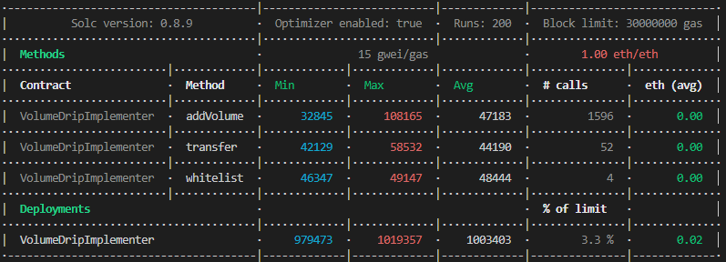

# VolumeDrip  
  
ERC20 implementation for automated volume per epoch based Token emission.  
Automatically update Token balance on every call.
  
Could be useful for automating Token farming on a Dex.
  
Shout out to 0xBeans and his DRIP20 implementation for the inspiration:  
https://github.com/0xBeans/DRIP20
  
## Gas measuring  
  
  